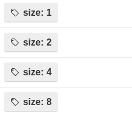
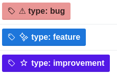
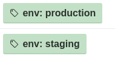
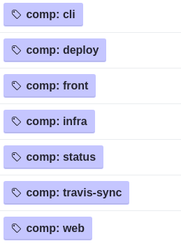
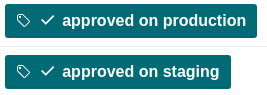
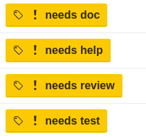

# Quick and dirty tool to manage our kanban on top of github project

## Run

```
docker run --rm -it -e GITHUB_ACCESS_TOKEN=... -e PROJECT_ID=... squarescale/update-sprint-info
```

## Details

All is based on conventions and labels

### Labels

#### Size

Allow to set an estimation value for a task.



#### Type

Type of task.



#### Environment

Specify if the issue concern only one environment.



#### Components

Specify the target component if applicable.



#### Check

Check if a task contains mockups and test case.


And if the task has been tested on staging and production environments.



All this labels are used to raise warnings on tasks. By example a task in done
without being approved on production raises a warning. A task in development
without test case raises a warning.

#### Special labels

If a task is blocked for any reason (blocked by an other, maybe the task
introduces a new bug, etc) the "blocked" label should be placed to indicate we
cannot move it before removing the label.

An explanation must be added in comment of the task.


Some labels can be added to request help, review, test, etc. They are just
informative to help us to easily what's needed by a task at a moment.


